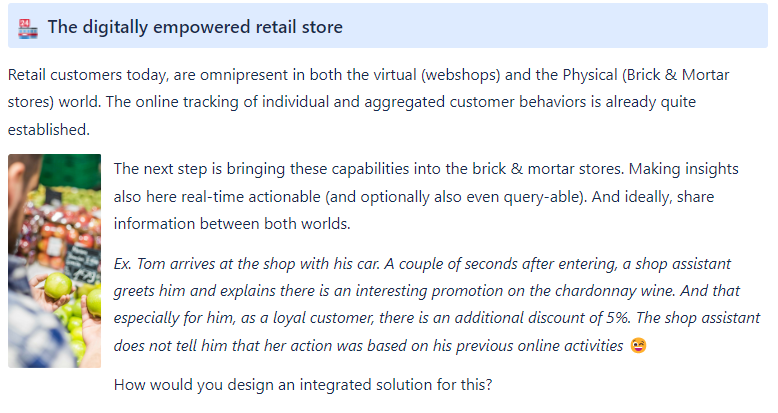
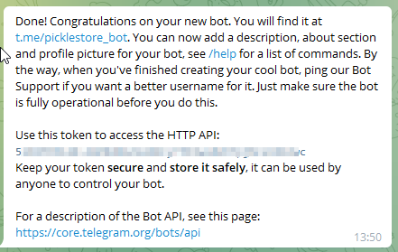
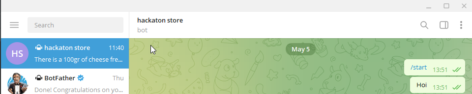
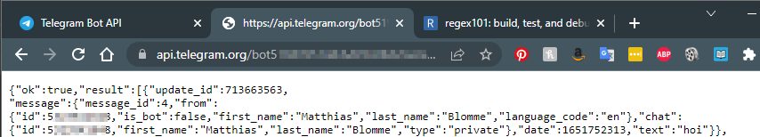

# picklerick_store
I8C Hackaton 

## Use case



## Approach

We felt that the use case closely resembles the Amazon online and brick&mortar store approach [Amazon Go](https://www.amazon.com/b?ie=UTF8&node=16008589011).
Offering people personalized suggestions and discounts on any screen they prefer to use (be it a hand-held 
scanner or their mobile devices).

This drove us to develop a Python Web App that we are running from a Raspberry Pi and are accessing from a phone 
and a tablet.

Just to make things interesting, it seemed fun to incorporate a fully functional barcode scanner in the webapp (since ) 


## Setup 

### Web server and web app
<b>Setting up Flask webserver</b>
In order to communicate to with Confluent Kafka we used a flask front-end web application. To set this up you'll need to install the following
 - Python3.9
 - python flask package
 - pythpn pymonogo package
 - python pyopenssl package
 - python confluent_kafka package
 
Flask is a web framework that's written in Python. Which allows you to write standard web applications.
In this project it is used as a frontend to communicate with the confluent kafka API. This is done through the confluent_kafka module.

To communicate with kafka we'll need to define a producer and consumer.
<b>Producer</b><br/>
```
p = Producer({
    'bootstrap.servers': 'URl of your Confluent Cloud instance',
    'security.protocol': 'SASL_SSL',
    'sasl.mechanism': 'PLAIN',
    'sasl.username': 'your kafkaKey',
    'sasl.password': 'your kafkaSecret',
    'error_cb': error_cb,
}
```
<b>Consumer</b><br/>
```
c = Consumer({
    'bootstrap.servers': 'URl of your Confluent Cloud instance',
    'security.protocol': 'SASL_SSL',
    'sasl.mechanism': 'PLAIN',
    'sasl.username': 'your kafkaKey',
    'sasl.password': 'your kafkaSecret',
    'group.id': "consumer groupID",
    'error_cb': error_cb,
})
```
The error_cb value is used for generic client errors. 
To actually put data on our topic we'll use the produce() function.
The poll() function is to receive an acknowledgement that the data has been sent.
The flush() function calls the poll function untill the given timeout is reached.
```
    p.produce('inser your topic name', key="insert a key to pair with your data", "the data itself")
    p.poll(1)
    p.flush(10)
```
To consume data from a topic you first have to subscribe to it. This is through the subscribe() function for which you give the topic you want to consume as parameter.
```
    c.subscribe(topics=['put topic name here.'])
```
To poll for messages you use the same method as the Producer.
And if you want to stop consuming just use the close() function.


### Telegram
<b>Setting up Telegram to receive notifications</b><br/>
In order to use Telegram as a notification server, you need to create a bot.
Creating bots is wel documented in multiple blogs and tutorials so we won't go in to much detail
here.

After installing and login into telegram, search for the BotFather bot (note the blue checkmark)


Send it the message 
`/start`

And follow the new bot wizard by sending
`/newbot`

When your bot is created you should receive a message like the one below containing your access token.
With this token you can control your bot so don't just hand it out.
\

From this point on you can interact with your bot. Search for your bot and send the start message and some random text 
(you need to do this in order to complete the following steps). 


Next open a browser and send a getUpdates call to your bot on the url
`https://api.telegram.org/bot<api_key>/getUpdates`

This will give you the following information


The obfuscted value is the id of the chat between the bot and myself (if someone else starts chatting 
with this bot they will receive a different chat id). This value and the api key will be required in confluenct.

Sending a message to the bot can be done in the same way:
`https://api.telegram.org/bot<api_key>/sendMessage?chatid=<chatid>&text="hello world"`

### Confluent

#### Telegram sink connector
In order to get telegram working from the confluent cloud need to create a http sink connector.
We used 3 different notification, each with their own input topic
 - Pairing: get a food pairing based on an item you scan
 - Promotion: get a (list of) promotion(s) 
 - Receipt: get your digital receipt

You can find each configuration in the telegram_sink folder. The telegram connection is constructed from the following
parameters
 - "http.api.url": "https://api.telegram.org/bot<api key>/sendMessage",
 - "batch.prefix": "{\"chat_id\":\"<chat id>\",",
 - "batch.suffix": "}",
 - "regex.patterns": ".*PA_PAIRINGNAME=(.*?),.*ITEMNAME=(.*?)}",
 - "regex.replacements": "\"text\":\"$1 pairs very well with $2\"",
 - "regex.separator": "~",

They construct the sendMessage api call to your bot.